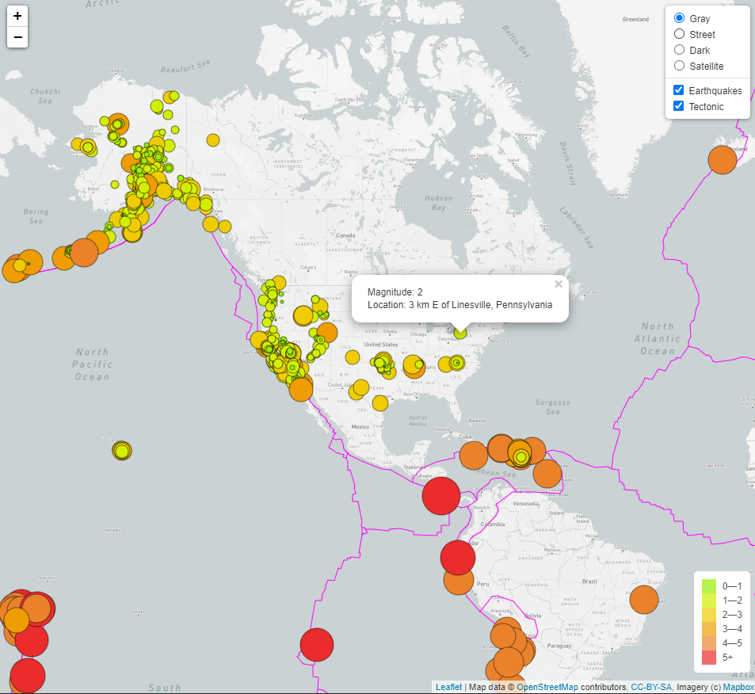

# Earthquake_Maps
---

### Purpose  
--- 
###### 
Worldwide visualization of earthquakes from the last seven days.  

### Resources  
---  
######  
API - USGS  
JavaScript  
HTML  
CSS  
D3  
GeoJSON  
Mapbox  
Leaflet 
https://github.com/fraxen/tectonicplates  
   The data was downloaded from http://peterbird.name/oldFTP/PB2002/ in June 2014. A copy of the original data is available in the original folder of this repo, with some very minor updates.

##  Results
---  

######
Added a couple of more layers to the base layer option.  Also enabled tectonic plates and earthquakes as selectable options.

[Image 1.] Selectable earthquake views.
